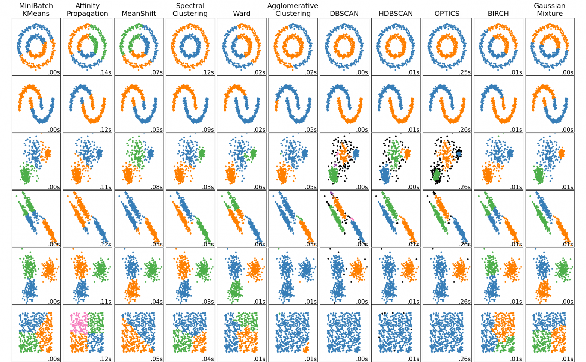

**Алгоритм DBSCAN** (Density-Based Spatial Clustering of Applications with Noise) — метод кластеризации, основанный на плотности данных. 

Вот его основные компоненты и шаги:

---

### **Гиперпараметры**
1. **ε-окрестность (epsilon)**:  
    Радиус вокруг точки, в котором ищутся соседи
2. **minPts**:  
   Минимальное количество точек в ε-окрестности, чтобы точка считалась **ядром**

---

### **Типы точек**
1. **Ядерные точки** (core points):  
    Точки в кластере, имеющие в своей ε-окрестности minPts соседей или более. Это означает, что точки лежат в области высокой плотности данных

2. **Пограничные точки** (border points):  
    Точки в кластере, которые имеют меньше, чем minPts соседей в своей ε-окрестности, но лежат в ε-окрестности других базовых точек. Это означает, что точки лежат на границе кластеров

3. **Шумовые точки** (noise points):  
    Выбросы, которые не принадлежат ни к одному кластеру, то есть точки расположены в области низкой плотности данных

---

### **Шаги алгоритма**
1. **Выбор начальной точки**:  
   Берётся произвольная необработанная точка. Если она не является ядром, помечается как шум.
2. **Поиск всех достижимых точек**:  
   Если точка — ядро, формируется кластер. Все точки в её ε-окрестности добавляются в кластер.
3. **Расширение кластера**:  
   Для каждой новой точки в кластере проверяется, является ли она ядром. Если да, её ε-окрестность также добавляется в кластер.
4. **Повторение**:  
   Процесс повторяется для всех необработанных точек. Невошедшие в кластеры точки помечаются как шум.

---

### **Преимущества**
- Не требует задания числа кластеров заранее.
- Обнаруживает кластеры произвольной формы (в отличие от k-means).
- Устойчив к шуму и выбросам.

---

### **Недостатки**
- Чувствителен к выбору *ε* и *minPts*.
- Плохо работает с кластерами разной плотности.
- Сложность вычислений: в худшем случае *O(n²)*, но оптимизации (например, индексация) снижают до *O(n log n)*.

---
### **Сравнение с другими алгоритмами**

[//]: # (Source: https://scikit-learn.org/stable/modules/clustering.html)

---

**Итог**: DBSCAN эффективен для данных с неравномерной плотностью и наличием шума, но требует тщательного подбора параметров.

[//]: # (оригинальная статья: https://www.dbs.ifi.lmu.de/Publikationen/Papers/KDD-96.final.frame.pdf)

[//]: # (хабр 1: https://habr.com/ru/articles/322034/)

[//]: # (хабр 2: https://habr.com/ru/articles/798331/#dbscan)