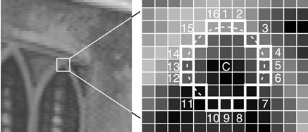

Детектор особых точек ORB (Oriented FAST and Rotated BRIEF) — алгоритм, основанный на комбинации детектора FAST и дескриптора BRIEF.

Далее представлены основные этапы этого метода:

---

### 1. **Обнаружение угловых точек с помощью FAST**
   - **FAST (Features from Accelerated Segment Test)**:
     - Для каждой точки анализируются 16 пикселей из окружности.
     - Точка считается подозрительной на особую, если определённое количество соседей (обычно 9-12) значительно ярче или темнее её. ${I_p} > {I_c} + t$ или ${I_p} < {I_c} - t$, где $t\,-$ пороговая величина <!---Возможно стоит написать про упрощение в виде рассмотрения определенных номеров пикселей -->
     - Для обнаруженных точек вычисляется мера Харриса, кандидаты с низким значением меры Харриса отбрасываются. По умолчанию в ORB максимальное количество точек - 500
     - Для инвариантности к масштабированию применяется алгоритм на пирамиде Гаусса.  <!--- Разный масштаб изображения -->
     - Вычисляется угол ориентации $\theta  = atan2 \left( {{m_{01}},{m_{10}}} \right) ; \, {m_{pq}} = \sum\limits_{x,y} {{x^p}{y^q}I\left( {x,y} \right)} $

[//]: # (Source: https://habr.com/ru/articles/414459/)

---

### 2. **Построение дескриптора BRIEF**
   - **BRIEF (Binary Robust Independent Elementary Features)**:
     - Дескриптор формируется как бинарный вектор размерности 256, сравнивающий яркости случайных пар пикселей в окрестности 31x31 пикселя вокруг ключевой точки:
   
     $$
     \tau \left( {p;x,y} \right) = \left\{ {\begin{array}{*{20}{c}} {1:{p_x} < {p_y}}\\ {0:{p_x} \ge {p_y}} \end{array}} \right.
     $$
     где p - интенсивность области 5x5

     - Пары пикселей поворачиваются на угол ориентации θ для достижения инвариантности по вращению
     - Для повышения качества ORB **оптимизирует выбор бинарных тестов**
   

[//]: # (Возможно, стоит формально записать вектор дескриптора из презентации / оригинальной статьи: https://sci-hub.ru/10.1109/ICCV.2011.6126544) 
     

---

### Преимущества ORB
- **Высокая скорость**: Быстрее SIFT и SURF за счёт бинарных операций.
- **Инвариантность**: К повороту, масштабу (с пирамидой) и небольшим изменениям освещения.
- **Низкие требования к памяти**: Бинарные дескрипторы компактны.
- **Открытая реализация**: В отличие от патентованных SURF/SIFT.

---

### Недостатки
- Менее устойчив к сильным изменениям освещения или перспективным искажениям.
- Точность может уступать SIFT в сложных сценах.

---

### Применение
- Сопоставление изображений (например, в SLAM-системах).
- Распознавание объектов.
- Дополненная реальность (AR).
- Редактирование фото (панорамная склейка).

ORB стал популярным выбором для задач, где важны скорость и ресурсоэффективность, например, в мобильных приложениях или робототехнике.

[//]: # (Sources: презентация + habr + deepseek)