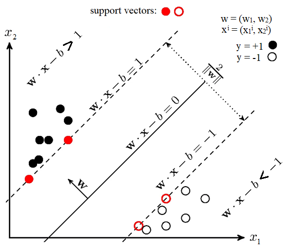

## Краткий обзор

Support Vector Machine (SVM) — это один из наиболее важных и широко используемых методов машинного обучения, основанный на статистической теории обучения (VC‑теории). Основная идея SVM заключается в построении оптимальной разделяющей гиперплоскости, которая максимально отдалена от ближайших точек разных классов (так называемых опорных векторов) в многомерном пространстве признаков. Благодаря «трюку ядра» SVM может эффективно выполнять нелинейную классификацию, неявно отображая данные в пространство более высокой размерности и возвращаясь к исходным через функцию ядра. Помимо классификации, SVM также применяется для регрессии и обнаружения выбросов.

---

## 1. Основная идея SVM

### 1.1. Линейная классификация

* Рассматривается обучающая выборка
  $(\mathbf{x}_1, y_1), \dots, (\mathbf{x}_n, y_n),$
  где $\mathbf{x}_i \in \mathbb{R}^p$, а метка $y_i \in \{+1, -1\}$.
* SVM ищет гиперплоскость
  $\mathbf{w}^\top \mathbf{x} - b = 0$
  такую, что расстояние (зазор) от неё до ближайших точек каждого класса максимально.
* Функциональный маржин определяется как
  $\gamma = \min_i \; y_i(\mathbf{w}^\top \mathbf{x}_i - b).$
  Максимизация $\gamma/\|\mathbf{w}\|$ обеспечивает наибольшую устойчивость к шуму и переобучению.

### 1.2. Опорные векторы

* Только те точки, которые лежат на границе зазора (то есть для которых $y_i(\mathbf{w}^\top \mathbf{x}_i - b)=\gamma$), называются опорными векторами.
* Решение SVM выражается через них и коэффициенты Лагранжа, что делает классификатор экономным по памяти.

---

## 2. Нелинейная классификация и «трюк ядра»

### 2.1. Идея

Когда данные не линейно разделимы, вводится отображение
$\varphi: \mathbb{R}^p \to \mathcal{H},$
где $\mathcal{H}$ — пространство высокой (иногда бесконечной) размерности.

### 2.2. Ядро

* Вместо явного вычисления $\varphi(\mathbf{x})$ используется функция ядра
  $k(\mathbf{x}, \mathbf{z}) = \langle \varphi(\mathbf{x}), \varphi(\mathbf{z})\rangle.$
* Популярные ядра: линейное, полиномиальное, радиальное базисное (RBF), сигмоидальное.

---

## 3. Регрессия и обнаружение выбросов

* SVM для регрессии (SVR) формулируется подобным образом, но с $\varepsilon$-зазором, внутри которого ошибки не штрафуются.
* Задача обнаружения выбросов (One‑Class SVM) ищет разделяющую поверхность, отделяющую «нормальные» объекты от аномалий ([scikit-learn][3]).

